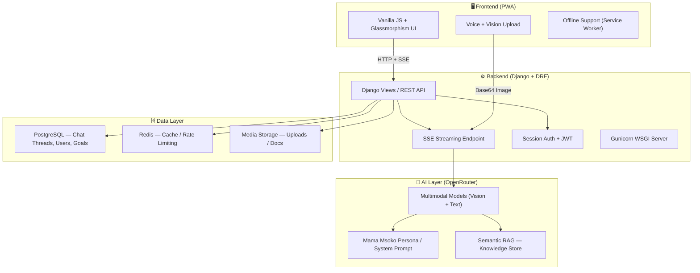

# 🛒 Msoko AI — Strategic Hustle Intelligence for African Entrepreneurs

> **Mama Msoko** is your AI-powered biashara mentor — speaking Swahili, Sheng, and business. Built for mama mbogas, bodaboda hustlers, mitumba traders, and every small entrepreneur grinding in East Africa.

[](https://www.djangoproject.com/)
[](https://www.django-rest-framework.org/)
[](https://openrouter.ai/)
[](https://web.dev/progressive-web-apps/)
[](LICENSE)
[](https://teklini.tech)

---

## 🌐 Live Demo

> 🚧 **Coming soon** — Deploying on [Railway](https://railway.app) / [Render](https://render.com).  
> Track progress on the [`upgrade-phase1`](https://github.com/bmcouma/msoko-ai/tree/upgrade-phase1) branch.

---

## 🏗️ Architecture



---

## ✨ Why Msoko Stands Out

| Feature | Msoko AI 🛒 | Generic Chatbot 🤖 |
|---|---|---|
| **Local language** | Swahili + Sheng fluent | English only |
| **Business context** | Mama mboga, boda, mitumba persona | Generic assistant |
| **Vision analysis** | Inventory photo → pricing advice | Text only |
| **Persistent threads** | Full chat history per user | One-shot or basic memory |
| **Business profile** | Tracks your sector, goals, revenue | No business context |
| **SSE streaming** | Real-time token-by-token response | Request/response only |
| **PWA** | Installable, offline-ready | Web only |
| **African market data** | RAG-backed local market knowledge | Generic global training |
| **Goal tracking** | Revenue targets, milestones | None |
| **Open source** | MIT licensed, self-hostable | Closed / SaaS |

---

## 🌟 Core Capabilities

### 🧠 Strategic Coaching
- **Business Profiler**: Context-aware advice tailored to your sector and stage.
- **Executive Dashboard**: Track growth metrics, active goals, and strategic insights.
- **Goal Engine**: Set revenue targets, inventory milestones, and savings goals.

### 👁️ Multimodal Intelligence
- **Vision Analysis**: Upload your inventory photos — Mama Msoko tells you what to restock and at what price.
- **Document Analysis**: Upload Excel/CSV sales records for AI-powered trend analysis.
- **Voice Flow**: Hands-free strategic sessions.

### ⚡ Engineering Excellence
- **SSE Streaming**: Real-time responses, character by character.
- **PWA**: Install on your phone's home screen. Works offline.
- **Glassmorphism UI**: Premium dark-mode interface built for low-latency performance.

---

## 🛠️ Tech Stack

| Layer | Technology |
|---|---|
| Backend | Django 5, Django REST Framework |
| AI | OpenRouter (multimodal, auto-model) |
| Frontend | Vanilla JS, CSS Glassmorphism, PWA |
| Database | PostgreSQL (SQLite in dev) |
| Cache | Redis |
| Static Files | WhiteNoise |
| Server | Gunicorn |
| Admin | Jazzmin (dark theme) |

---

## 🚀 Getting Started

### Option A: Local Development (Python)

```bash
# 1. Clone the repo
git clone https://github.com/bmcouma/msoko-ai.git
cd msoko-ai

# 2. Set up environment
cp .env.example backend/.env
# Edit backend/.env and add your OPENROUTER_API_KEY

# 3. Install dependencies
pip install -r requirements.txt

# 4. Run migrations and start
cd backend
python manage.py migrate
python manage.py runserver
```

Visit [http://localhost:8000](http://localhost:8000) — Mama Msoko is ready to hustle.

---

### Option B: Docker (Recommended for Production)

```bash
# 1. Clone and configure
git clone https://github.com/bmcouma/msoko-ai.git
cd msoko-ai
cp .env.example .env
# Edit .env with your values

# 2. Build and start all services
docker-compose up --build

# 3. Run migrations (first time)
docker-compose exec web python backend/manage.py migrate
docker-compose exec web python backend/manage.py createsuperuser
```

Visit [http://localhost:8000](http://localhost:8000)

> **Services started**: Django + Gunicorn (`web`), PostgreSQL (`db`), Redis (`redis`).

---

### Deploy to Railway (One-Click)

[](https://railway.app/new/template)

1. Set environment variables from `.env.example` in the Railway dashboard.
2. Add a PostgreSQL plugin and a Redis plugin.
3. Deploy from the `main` branch.

---

## ⚙️ Environment Variables

See [`.env.example`](.env.example) for a full list. Key ones:

| Variable | Description |
|---|---|
| `SECRET_KEY` | Django secret key |
| `OPENROUTER_API_KEY` | Your OpenRouter API key |
| `DATABASE_URL` | Postgres connection string |
| `REDIS_URL` | Redis connection string |
| `DEBUG` | `True` for dev, `False` for prod |

---

## 🤝 Contributing

Pull requests are welcome. For major changes, open an issue first. See [LICENSE](LICENSE) for terms.

---

## 🏢 About Teklini Technologies

> *We build intelligent systems that solve real African problems.*

- 🌐 [teklini.tech](https://teklini.tech)
- 💬 [WhatsApp](https://wa.me/254791832015)
- © 2026 Teklini Technologies — MIT Licensed
